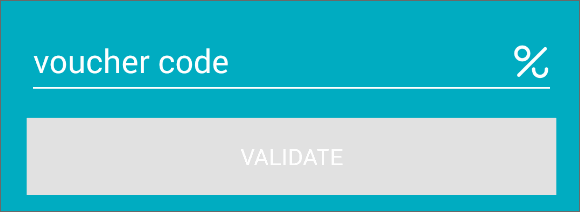

Voucherify Android SDK
======================

###Version: 0.3.1

Android SDK for Voucherify to validate a voucher on client side.

[Voucherify](http://voucherify.io?utm_source=inbound&utm_medium=github&utm_campaign=voucherify-android-sdk) has a new platform that will help your team automate voucher campaigns. It does this by providing composable API and the marketer-friendly interface that increases teams' productivity:

- **roll-out thousands** of vouchers **in minutes** instead of weeks,
- **check status** or disable **every single** promo code in real time, 
- **track redemption** history and build reports on the fly.

You can find full documentation on [voucherify.readme.io](https://voucherify.readme.io).

Try a demo app from Google Play:

<a href='https://play.google.com/store/apps/details?id=pl.rspective.voucherify.android.demo'></a>

Setup
=====

###### Using Gradle:

```groovy
dependencies {
    compile 'pl.rspective.voucherify.android.client:voucherify-android-sdk:0.3.1'
}
```

###### Using Maven:

```xml
<dependency>
    <groupId>pl.rspective.voucherify.android.client</groupId>
    <artifactId>voucherify-android-sdk</artifactId>
    <version>0.3.1</version>
</dependency>
```

NOTE:
The SDK requires at least Java 6 or Android 2.3.3 (API 10)


### Default Client

The Voucherify Android SDK uses [Retrofit](http://square.github.io/retrofit/) under the hood as a REST client, which detects [OkHttp](http://square.github.io/okhttp/) in your classpath and uses it if it's available, otherwise falls back to the default `HttpURLConnection`.
If you want you can also specify a custom client to be used (see javadoc).


### Proguard
```
-keepattributes Signature
-dontwarn rx.**
-dontwarn retrofit.**
-keep class retrofit.** { *; }
-keep class com.rspective.voucherify.android.client.** { *; }
-keep class * extends com.rspective.voucherify.android.client.model.** { *; }
-keep class com.google.gson.** { *; }
-keep class sun.misc.Unsafe { *; }
```

Usage
=====
The `VoucherifyAndroidClient` manages your interaction with the Voucherify API.

```java
VoucherifyAndroidClient client = new VoucherifyClient.Builder(YOUR-PUBLIC-CLIENT-APPLICATION-ID, YOUR-PUBLIC-CLIENT-APPLICATION-TOKEN).build();
```

We are tracking users which are validating vouchers with those who consume them, by a `tracking_id`. By that we are setting up an identity for the user. If you want to provide your custom value for `tracking_id`, you have to do it when creating VoucherifyAndroidClient:

```java
androidClient = new VoucherifyAndroidClient.Builder(YOUR-PUBLIC-CLIENT-APPLICATION-ID, YOUR-PUBLIC-CLIENT-APPLICATION-TOKEN)
       .withCustomTrackingId(YOUR-CUSTOM-TRACKNG-ID)
       .build();
```

Otheres additional params which can be set:
* origin
* endpoint
* log level

```java
androidClient = new VoucherifyAndroidClient.Builder(YOUR-PUBLIC-CLIENT-APPLICATION-ID, YOUR-PUBLIC-CLIENT-APPLICATION-TOKEN)
       .withCustomTrackingId(YOUR-CUSTOM-TRACKNG-ID)
       .withOrigin("http://my-android-origin")
       .setEndpoint("10.0.3.2:8080")
       .setLogLevel(RestAdapter.LogLevel.FULL)
       .build();

```

Current list of features:
- validate voucher based on his code


Every method has a corresponding asynchronous extension which can be accessed through the `async()` or 'rx()' method of the vouchers module.

```java
try {
    VoucherResponse voucher = client.vouchers().validate(VOUCHER_CODE);
} catch (RetrofitError e) {
    // error
}
```

or asynchronously:

```java
client.vouchers().async().validate("VOUCHER_CODE", new VoucherifyCallback<VoucherResponse>() {
    @Override
    public void onSuccess(VoucherResponse result) {
    }

    @Override
    public void onFailure(RetrofitError error) {
    // error
  }
});
```

or using RxJava:

```java
client.vouchers()
        .rx()
        .validate("VOUCHER_CODE")
        .subscribeOn(Schedulers.io())
        .observeOn(AndroidSchedulers.mainThread())
        .subscribe(new Action1<VoucherResponse>() {
            @Override
            public void call(VoucherResponse voucher) {

            }
        }, new Action1<Throwable>() {
            @Override
            public void call(Throwable throwable) {
            }
        });
```


VoucherResponse
=====

 /*

    {
        "valid": true,
        "discount": {
            "type": "AMOUNT",
            "amount_off": 999,
        },
        "tracking_id": "generated-or-passed-tracking-id"
    }

    OR

    {
        "valid": true,
        "discount": {
            "type": "PERCENT",
            "amount_off": 15.0,
        },
        "tracking_id": "generated-or-passed-tracking-id"
    }

    OR
    
    {
        "valid": true,
        "discount": {
            "type": "UNIT",
            "amount_off": 1.0,
        },
        "tracking_id": "generated-or-passed-tracking-id"
    }

    OR
    {
        "valid": false,
        "type": null,
        "discount": null,
        "tracking_id": "generated-or-passed-tracking-id"
    }

    OR

    {
        "type": "error",
        "message": "More details will be here."
        "context": "Here you will receive context of that error."
    }

 */

### Voucher Checkout View

You can use VoucherCheckoutView to quickly add a UI for discount codes validation.



In your layout XML file add:

```xml
<pl.rspective.voucherify.android.view.VoucherCheckoutView
    android:id="@+id/voucher_checkout"/>
```

Then in your activity init the VoucherCheckoutView with the VoucherifyAndroidClient.

```
VoucherifyAndroidClient voucherifyClient = new VoucherifyAndroidClient.Builder(
            YOUR-PUBLIC-CLIENT-APPLICATION-ID,
            YOUR-PUBLIC-CLIENT-APPLICATION-TOKEN)
       .withCustomTrackingId(YOUR-CUSTOM-TRACKNG-ID)
       .build();

VoucherCheckoutView voucherCheckout = (VoucherCheckoutView) findViewById(R.id.voucher_checkout);
```

You will also likely want to get validation results. You can achieve that by adding OnValidatedListener:

```
voucherCheckout.setOnValidatedListener(new OnValidatedListener() {
    @Override
    public void onValid(final VoucherResponse result) {
    }

    @Override
    public void onInvalid(final VoucherResponse result) {
    }

    @Override
    public void onError(VoucherifyError error) {
    }
});
```

#### Customization

The component is highly customizable. You can set following attributes:

- `validateButtonText` - text displayed on the button
- `voucherCodeHint` - label attached to the voucher code input
- `voucherIcon` - icon appearing on the right
- `validVoucherIcon` - icon appearing on the right after validation when provided code was valid
- `invalidVoucherIcon` - icon appearing on the right after validation when provided code was invalid 

You can disable any of the 3 icons by specifying them as `@android:color/transparent`.

Example:

```xml
<pl.rspective.voucherify.android.view.VoucherCheckoutView
    android:id="@+id/voucher_checkout"/>
    xmlns:app="http://schemas.android.com/apk/res-auto"
    app:validateButtonText="Apply"
    app:voucherCodeHint="Coupon Code"
    app:voucherIcon="@android:color/transparent"
    app:validVoucherIcon="@android:color/transparent"
    app:invalidVoucherIcon="@android:color/transparent"/>
```

You can override animations by placing `valid.xml` and `invalid.xml` in `res/anim`.

You can also set your own colors and other visual properties by defining styles (in `res\values\styles.xml`):

- VoucherCodeLabel
- VoucherCodeEditText
- VoucherValidateButton

For example to set the button background color to light green:

```
    <style name="VoucherValidateButton">
        <item name="android:background">#8BC34A</item>
    </style>
```


### Changelog

- **2016-05-20** - `0.3.1` - Enabled to show an error message below the code input.
- **2016-05-20** - `0.3.0` - Voucher checkout view
- **2016-05-19** - `0.2.0` - Custom error handling
- **2016-04-04** - `0.1.3` - Updated API URL, HTTPS enabled by default
- **2016-01-14** - `0.1.2` - Default value for `origin` header
- **2015-12-14** - `0.1.0` - New discount model, new discount type: UNIT
- **2015-11-23** - `0.0.9` - added `X-Voucherify-Channel` header
- **2015-11-09** - `0.0.6` - Changed discount type from double to integer
- **2015-11-05** - `0.0.5` - Renamed trackingId to tracking_id.
- **2015-10-22** - `0.0.4` - New backend URL.
- **2015-09-11** - `0.0.3` - Updated backend URL.
- **2015-08-15** - `0.0.2` - Added tracking id functionality
- **2015-08-11** - `0.0.1` - Initial version of the SDK.Ż
